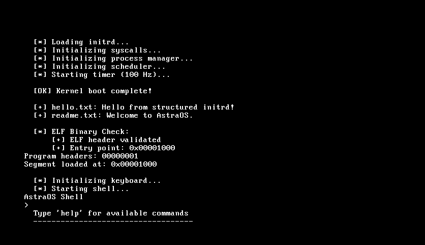

# AstraOS

Hey, moi c’est Astrazdq.

J’ai créé AstraOS juste pour le fun, pour apprendre comment un OS fonctionne derrière les écrans noirs et les lignes bizarres qu’on voit dans les vieux tutos kernel dev.

C’est un mini OS x86 écrit en C et en assembleur, pas un truc sérieux destiné à remplacer Linux, mais un projet perso pour expérimenter le boot, les interruptions, le clavier, le timer et construire un petit shell maison.

## Ce qu’il fait actuellement

- Boot avec GRUB (multiboot)
- Petit kernel 32-bit
- Gestion clavier
- Timer PIT
- Interruptions (IDT / PIC)
- Shell ultra basique
- Affichage VGA texte

Bref, le minimum pour commencer à jouer avec un kernel.

## Stack

- C
- NASM Assembly
- GRUB
- QEMU

## Build & lancement

### Prérequis

- `gcc` (avec support `-m32` / `gcc-multilib`)
- `nasm`
- `ld` (binutils)
- `grub-mkrescue` / `xorriso`
- `qemu-system-i386`

### Compiler

```bash
make
```

### Lancer dans QEMU

```bash
make run
```

## Structure rapide du projet

- `boot/`       -> démarrage du kernel
- `kernel/`     -> coeur du système
- `linker/`     -> linker script
- `build/`      -> fichiers générés



## Pourquoi ce projet ?

Parce que faire un OS c’est drôle.

Et aussi parce que c’est probablement la meilleure façon de comprendre :

- comment un PC démarre,
- ce qu’est vraiment un kernel,
- comment fonctionnent les interruptions,
- et pourquoi tout casse quand tu oublies un `sti`.

## Objectifs futurs

- meilleur shell
- gestion mémoire
- système de fichiers
- multitâche
- drivers
- interface graphique peut-être

## Disclaimer

Ce projet est expérimental. Il peut crash, freeze, reboot, exploser mentalement ton CPU (pas vraiment).

---

AstraOS — Un OS fait pour apprendre, casser des trucs et comprendre comment ça marche.
