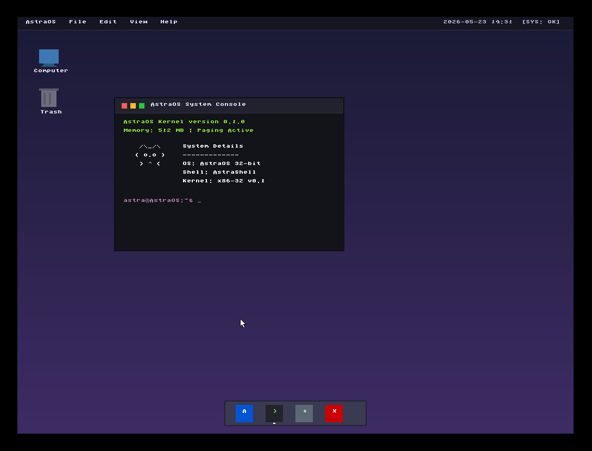

# AstraOS

AstraOS est un mini système d’exploitation x86 développé en C et en assembleur NASM.

Le projet a été créé dans un objectif d’apprentissage du fonctionnement bas niveau d’un OS :
bootloader, mémoire, interruptions, multitâche, ELF, drivers, etc.

Ce n’est pas un système destiné à remplacer Linux ou Windows, mais un vrai kernel expérimental développé from scratch pour comprendre comment fonctionne un ordinateur derrière le système d’exploitation.

---

## Screenshot





---

## Fonctionnalités actuelles

### Boot & architecture
- Boot via GRUB (Multiboot)
- Kernel 32-bit x86
- GDT / IDT
- Gestion des interruptions
- PIC remappé
- PIT timer

### Mémoire
- Heap kernel
- Paging
- Gestion des page faults

### Multitâche
- Scheduler basique
- Gestion de tâches kernel
- Support initial du ring3 / usermode

### Système
- Shell interactif
- Gestion clavier
- Affichage VGA texte
- Syscalls de base

### Filesystem & ELF
- VFS minimal
- Initrd structuré
- Parsing ELF
- Parsing Program Headers ELF

---

## Stack technique

- C
- NASM Assembly
- GRUB
- QEMU
- x86 (i386)

---

## Build & lancement

### Prérequis

Installer :

- `gcc-multilib`
- `nasm`
- `binutils`
- `grub-pc-bin`
- `xorriso`
- `qemu-system-x86`

### Compiler

```bash
make
```

Lancer
```bash
make run
```

Structure du projet 
```bash
boot/           -> entrée du kernel / multiboot
kernel/

  arch/         -> GDT, IDT, ISR, TSS
  core/         -> kernel principal, terminal, shell
  irq/          -> PIC, PIT, IRQ
  mm/           -> heap, paging
  fs/           -> VFS, initrd, ELF
  sched/        -> scheduler / tâches
  sys/          -> faults / exceptions

linker/         -> linker script
build/          -> fichiers compilés
iso/            -> structure ISO GRUB
```

Objectifs futurs
ELF loader complet
Exécution réelle de programmes userspace
Mémoire virtuelle avancée
Scheduler plus évolué
Drivers ATA
FAT32 / ext2
Interface graphique
Réseau
Audio
SMP / multicore
Passage 64-bit
Pourquoi ce projet ?

AstraOS existe principalement pour :

apprendre le kernel development
comprendre l’architecture x86
expérimenter le bas niveau
construire un OS étape par étape
Disclaimer

AstraOS est un projet expérimental.

Le système peut :

crash
reboot
freeze
triple fault
ou fonctionner correctement (parfois)
Auteur

Projet développé par Astrazdq.